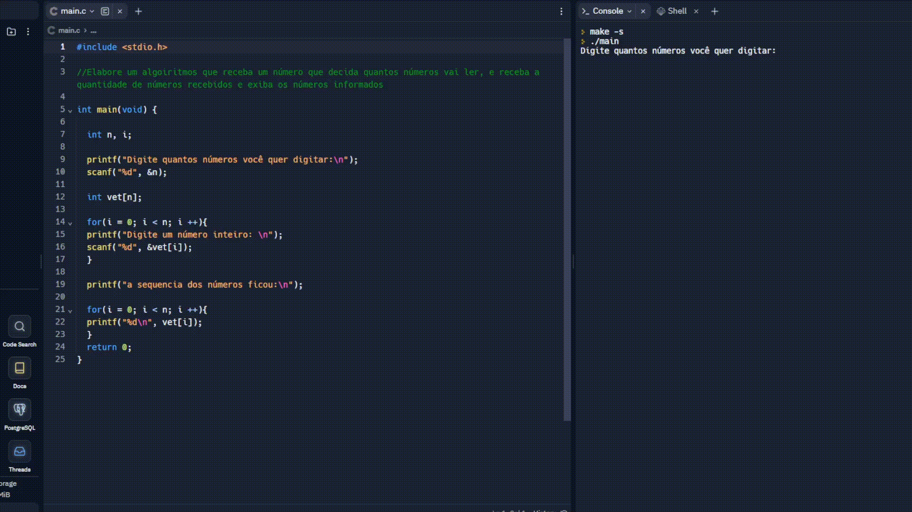

# Receba-numeros
Código em linguagem C. Um algoritmos que receba um número que decida quantos números vai ler, e receba a quantidade de números recebidos e exiba os números informados.
# Média 10 números 🔴
Este projeto pede um número para saber quantos números vai ler, recebe a quantidade de números solicitados e exibe os números informados. No código foi utilizado a linguagem C. 

 

## ⚡ Linguagem usada

 
 

 
 
 

## 💻 Reflexão

- Estudo da linguagem C, um código bem simples que abrange variáveis e estrutura de repetição.

- Skills da linguagem: estrutura de repetição(for), printf, scanf e variável int.

 
 

## 📸 Minhas redes

